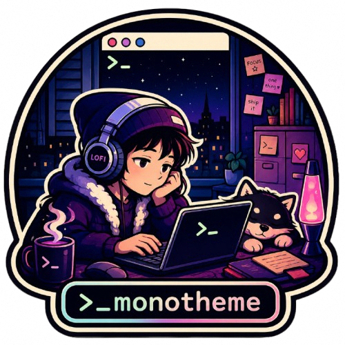

<p align="center">
  
</p>

https://github.com/user-attachments/assets/7d154016-a72d-4e58-b390-9d886b22e64c

# monotheme

> [!WARNING]
> **Alpha.** monotheme is early and evolving — APIs, adapters and theme output may
> change without notice. Expect rough edges; issues and PRs welcome.

One source of truth — a **standard editor theme** (the `colors` + `tokenColors`
JSON that VSCode, Cursor, Zed and [shiki](https://shiki.style) all read) —
projected into every tool's native format, switched with a single command that
live-reloads running apps.

Drop in any such theme (Shades of Purple, GitHub, Catppuccin, Tokyo Night, …) and
your whole terminal/editor/OS follows. No per-tool hand-porting.

> The `tokenColors` half is plain TextMate scopes (same model as a `.tmTheme`); the
> `colors` half adds the UI + `terminal.ansi*` keys a `.tmTheme` lacks — which is
> exactly what lets one file drive your terminal, btop and tmux as well as syntax.

```sh
theme set shades-of-purple
```

That one command reskins your terminal, multiplexer, editors, git UI, file
manager, system accent — live, no restarts.

## Why

Most theming tools use a **small palette** (16–24 colors) as the source of truth.
Great for terminals, lossy for syntax highlighting — a theme's ~140 TextMate
scopes collapse into ~16 buckets and everything subtly loses its identity.

monotheme keeps the **fat format** (the full VSCode theme) as canonical, and:

- **projects down** to 16-color ANSI for dumb tools (terminals, btop, fzf, …)
- **passes through** at full fidelity for smart ones (bat, editors, anything that
  reads a TextMate/shiki theme)

You can always collapse rich → simple, never the reverse. The syntax projection is
a faithful port of the vscode-textmate theme matcher, verified token-for-token
against [shiki](https://shiki.style) (the highlighter Cursor/VSCode use) so colors
match what you'd see in the editor.

## Supported tools

| Surface | Tools |
| --- | --- |
| Terminals | ghostty, any 16-ANSI terminal |
| Multiplexers / TUI | tmux, btop, fzf, yazi, lazygit |
| Editors | VSCode, Cursor, Zed, Neovim (chrome + TextMate syntax) |
| Agents / dev | opencode, Claude Code, hunk |
| Syntax export | `.tmTheme` (bat/Sublime), shiki JSON, base16 |
| macOS / extras | system accent color, Raycast, herdr |

Each target detects whether the tool is present and no-ops if not, so you only
theme what you have.

## Install

Requires [Bun](https://bun.sh).

```sh
git clone https://github.com/eduwass/monotheme
cd monotheme
bun install
bun run src/cli.ts list
```

Add a `theme` command to your PATH by symlinking a launcher, or run via `bun`
directly. See [`docs/INSTALL.md`](docs/INSTALL.md).

## Usage

```sh
theme list                 # installed + bundled themes
theme set <name>           # project a theme to every tool + live-reload
theme current              # the active theme
theme init                 # re-apply the active theme (run from your shell rc)
theme raycast              # open the active theme as a Raycast import (macOS)
theme check                # self-check, no writes
```

Themes resolve from `themes/*.json` (bundled) and your installed editor extensions
(it discovers Cursor/VSCode themes on disk). Drop any VSCode theme JSON into
`themes/` and it shows up in `theme list`.

## Cross-machine sync (optional)

Set `THEME_PEER=<ssh-host>` and every `theme set` mirrors the switch to that
machine, so all tools on both stay on the same theme. For non-SSH transports, set
`THEME_PEER_CMD='mytool run {}'` ( `{}` is replaced with the remote command).

## How it works

`load` parses the VSCode theme → `project` derives a normalized palette (bg, fg,
ANSI 16, accents, …) and `resolveToken` resolves any TextMate scope to its color
via the ported matcher → each **adapter** renders that into one tool's format →
**targets** write the file to the right place and reload the running app.

## Adding a tool

Adapters are small and self-contained. See [`docs/ADAPTERS.md`](docs/ADAPTERS.md)
for the contract and a step-by-step walkthrough. Contributions welcome — if you
theme a tool, others get it for free.

## License

MIT — see [`LICENSE`](LICENSE).
