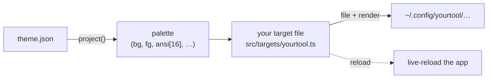

# Add a tool

Adding support for a tool is **one file**. Drop it in `src/targets/`, and monotheme
finds it automatically — there is no list to register it in, anywhere.



## Quick start

1. Copy the template:
   ```sh
   cp src/targets/_template.ts src/targets/yourtool.ts
   ```
2. Fill in the blanks (it's commented end to end).
3. Try it: `theme set shades-of-purple` — your tool shows up in the output.

That's it. The registry (`src/registry.ts`) globs `src/targets/*.ts` at startup; any
file that `export default defineTarget({...})` is picked up. Files starting with `_`
are ignored.

## The shape of a target

A target is one object. You pick **one** of two shapes:

### Simple (90% of tools) — declarative, no IO in your code

```ts
import { defineTarget } from "../target-kit.ts";
import { project } from "../project.ts";
import type { VscodeTheme } from "../load.ts";

function toFoo(theme: VscodeTheme): string {
  const p = project(theme);
  return `background ${p.bg}\nforeground ${p.fg}\n`;
}

export default defineTarget({
  name: "foo",
  detect: (c) => c.has(c.config("foo")),          // skip if not installed
  file:   (c) => c.config("foo", "monotheme.conf"), // where to write
  render: (c) => toFoo(c.theme),                    // what to write
  reload: (c) => "pkill -USR1 -x foo",              // optional: live-reload
});
```

The engine does the `mkdir -p`, the write, and runs `reload` for you — **errors are
swallowed**, so an app that isn't running is automatically a no-op. You never write
`2>/dev/null || true`.

### Custom (`build`) — multiple files / patch JSON / custom logic

```ts
export default defineTarget({
  name: "foo",
  detect: (c) => c.has(c.config("foo")),
  build: (c) => {
    c.write(c.config("foo", "themes", "monotheme.json"), toFoo(c.theme));
    c.setJson(c.config("foo", "settings.json"), "theme", c.slot); // patch one JSON key
    c.run("foo reload");                                          // run a reload cmd
    return "themes/monotheme.json (live-reload)";  // short status for the CLI output
  },
});
```

Use **either** `file` + `render` (+ `reload`) **or** `build` — never both. `defineTarget`
throws a clear error at load time if you mix them or forget a field.

## The context `c`

Every function on a target receives the same context. **Always use the path helpers**
— never hardcode `~/.config`, it's wrong on macOS app-support and Windows.

| | |
|---|---|
| `c.theme` | the raw VSCode theme (`colors` + `tokenColors`) |
| `c.palette` | projected palette: `bg, fg, ansi[0..15], accent, selection, cursor, border, success, error, warning, …` |
| `c.slot` | the stable slot name (`"monotheme"`) — use it for filenames |
| `c.entry` | active theme's discovery info (`label`, `source`) — for editor selectors |
| **paths** | |
| `c.config(...p)` | linux/mac → `~/.config/…` · win → `%APPDATA%\…` |
| `c.appSupport(...p)` | mac → `~/Library/Application Support/…` · linux/win → config dir |
| `c.data(...p)` | XDG data dir, per-OS |
| `c.home(...p)` | `~/…` |
| **platform** | `c.os` (`"mac"\|"linux"\|"win"`), `c.mac`, `c.linux`, `c.win` |
| **checks** | `c.has(path)` · `c.hasCmd("nvim")` |
| **effects** (for `build`) | `c.write(path, text)` (mkdir+write) · `c.read(path)` (`""` if missing) · `c.run(cmd)` (errors swallowed) · `c.setJson(file, key, val)` |

## Handling OS differences

Two things differ per OS: **where files live** and **how to reload**. Both are easy:

```ts
// paths: the helpers already resolve per-OS — just use them
file: (c) => c.config("ghostty", "themes", c.slot),

// reload: branch on the platform when it differs
reload: (c) => (c.mac ? `osascript -e '…'` : "pkill -USR2 -x ghostty"),
```

If a tool stores config somewhere unusual on one OS, branch in the path function too:
`file: (c) => (c.win ? c.home("AppData", "Roaming", "foo", ...) : c.config("foo", ...))`.

## Two layers: targets vs. formats

- **`src/targets/<tool>.ts`** — one file per app: its format function + the wiring. This
  is what you add.
- **`src/formats/`** — reusable encoders several apps share (`tmTheme` XML, `shiki` JSON).
  Only touch these if your tool consumes a format that already has a shared encoder
  (e.g. anything reading a TextMate/shiki theme → `toShiki`). Most tools don't need it.

## Getting syntax colors right

If your tool wants per-scope syntax colors (not just the 16 ANSI), resolve scopes with
`resolveToken(theme.tokenColors, scope)` from `../project.ts` — it's a faithful port of
the vscode-textmate matcher, verified token-for-token against shiki:

```ts
import { resolveToken } from "../project.ts";
const kw = resolveToken(c.theme.tokenColors, "keyword")?.fg ?? c.palette.accent;
```

## Conventions

- **Stable slot.** Write into one fixed file (`c.slot` = `monotheme`) the tool's config
  points at once — so switching themes overwrites that slot instead of editing the
  tool's main config. No churn.
- **Detect, don't assume.** Use `detect` so the target no-ops when the tool is absent.
- **Reload no-ops when the app is down.** It already does — errors are swallowed.
- **No new dependencies** unless genuinely unavoidable.

## Checklist before a PR

- [ ] `bun run src/cli.ts check` passes
- [ ] `bun test` passes (add a case to `test/engine.test.ts` asserting your `render`
      output — see the `terminal adapters` test for the pattern)
- [ ] `theme set <name>` shows your tool applying cleanly
- [ ] paths go through `c.config`/`c.appSupport`/`c.home` (no hardcoded `~/.config`)

## User adapters (outside the repo)

The same one-file contract works without touching the repo: drop a `.ts` file in
`~/.config/monotheme/targets/` and it's loaded after the built-ins on every
`theme set`. Export a **plain object** (no import needed — the registry validates it
with the same rules as `defineTarget`):

```ts
// ~/.config/monotheme/targets/sketchybar.ts
export default {
  name: "sketchybar",
  detect: (c) => c.hasCmd("sketchybar"),
  file:   (c) => c.config("sketchybar", "colors.sh"),
  render: (c) => `export BAR_BG=0xff${c.palette.bg.slice(1)}\nexport BAR_ACCENT=0xff${c.palette.accent.slice(1)}\n`,
  reload: () => "sketchybar --reload",
};
```

- A user target with the same `name` as a built-in **replaces** it — re-skin a stock
  adapter without forking.
- A broken user file warns and is skipped; it never breaks `theme set`.
